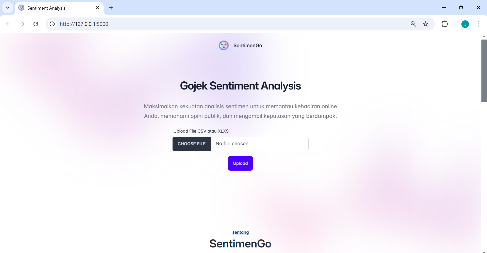

# SentimenGo

SentimenGo dirancang sebagai Project Akhir Program Studi Independen di MariBelajar Data Analyst & AI, yang merupakan sebuah aplikasi web yang menawarkan solusi otomatis untuk analisis sentimen terhadap ulasan pelanggan yang diunggah dalam format file CSV. Sistem SentimenGo menggunakan model BERT, yang merupakan salah satu algoritma deep learning paling canggih untuk memahami konteks dalam teks.

## Team

Dirancang oleh Kelompok 7 - Gema Indonesia:

- Josephine - Mentee MariBelajar | Data Analyst & AI
- Fatmah - Mentee MariBelajar | Data Analyst & AI
- Roro Pradnya Palupi - Mentee MariBelajar | Data Analyst & AI
- Sekar Ayu Danastri - Mentee MariBelajar | Data Analyst & AI

Dibimbing oleh:

- Rinaldi - Mentor MariBelajar | Data Analyst & AI

## Fitur Utama

- Analisis Sentimen Otomatis (Positif, Negatif, Netral).
- Unggah & Download File CSV Hasil Analisis.
- Visualisasi Dinamis yang Mudah Dipahami.
- Akses Mudah di Desktop & Mobile (pengembangan aplikasi web dan mobile sedang direncanakan!).

## Tech Stack

- Frontend: HTML, CSS, JavaScript, Tailwind CSS
- Backend: Python Flask
- Machine Learning: BERT
- Deployment:
  - Backend: [bert-sentimengo on Hugging Face](https://huggingface.co/josephine-huggingface/bert-sentimengo)

## Setup Local Development

1. Clone repository ini
2. Install dependencies dengan menjalankan perintah `pip install -r requirements.txt`
3. Konfigurasikan path untuk menyimpan file input dan output pada `app.config['CSV_OUTPUT_FOLDER']`, `app.config['PDF_REPORT_FOLDER']`, `app.config['INPUT_FOLDER']` di dalam file `app.py`.
4. Jalankan aplikasi dengan perintah `python app.py`
5. Buka browser dan akses `http://127.0.0.1:5000` untuk melihat website

## Cara Penggunaan

1. Buka aplikasi melalui link di atas
2. Upload file CSV atau Excel dengan kolom `content`, `score`, `thumbsUpCount`, `reviewCreatedVersion`, `at`, dan `kota`.
3. Klik tombol "Upload"
4. Lihat Preview Data, lalu klik tombol "Start Analyze"
5. Hasil analisis sentimen akan ditampilkan dan dapat diunduh dalam bentuk Report PDF atau CSV.
6. Hasil analisis juga akan otomatis disimpan ke dalam Sharepoint, untuk analisis lebih lanjut di Power BI.
